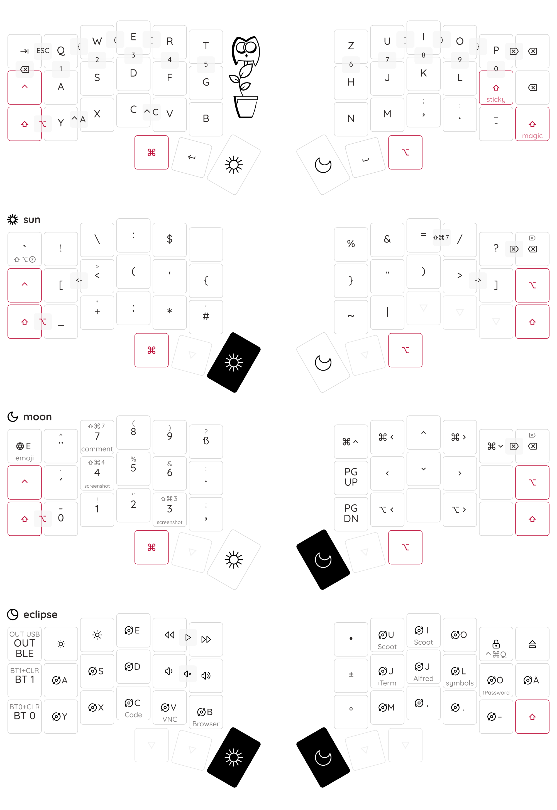

# Keyboard Firmware for Corne • QWERTZ • macOS • ZMK




## Features

- **QWERTZ** This layout is intended to be used with macOS' German keyboard layout (`Deutsch > Deutsch` or `Deutsch > ABC — QWERTZ`)
- **screen brightness** The F16 and F17 keys on the _eclipse_ layer are intended to be mapped to external screen brightness control, e.g. with [Lunar](https://lunar.fyi/) or [florianbeck/BrightnessMenulet](https://github.com/florianbeck/BrightnessMenulet).
- **hyper** Many keys on the `eclipse` layer are mapped to the <kbd>HYPER</kbd> modifier (<kbd>⇧⌃⌥⌘</kbd>), symbolized by the orbit symbol. Those keys can be mapped to global shortcuts.
   - the keyboard shortcuts on the right side, for iTerm, Alfred and 1Password are directly mapped in those apps as hotkeys.
   - the keyboard shortcuts on the left side, for VS Code, VNC Viewer, and the Browser are mapped with Alfred to open/activate the respective app.
- **magic shift** The right _magic_ shift key on the base layer behaves like
   - a regular RSHIFT when held,
   - a sticky RSHIFT when tapped (to capitalize the next letter), and
   - like `&caps_word` when double-tapped (to capitalize the next word).
- **mouse replacement** [Scoot](https://github.com/mjrusso/scoot) can be used to replace the mouse (using <kbd>hyper I</kbd> and <kbd>hyper U</kbd> on the _eclipse_ layer)
- **numblock** The moon layer features a numblock for the left hand, with `.` and `,` nearby. The shifted numbers 3, 4 and 7 press the <kbd>cmd</kbd> modifier as well, so in order to e.g. send <kbd>cmd shift 7</kbd> (line comment in VS Code), you can press <kbd>moon shift 7</kbd>.
- **mirrored symbols** Many symbols in the _sun_ layer, many symbols are mirrored between the left and the right hand, like the braces `[]<>(){}`, the slashes `\/`, and `_-` `;,` `!?`.
- **non-dead backtick** The backtick on the German macOS keyboard layout is a dead key, which messes up some text input fields. The upper left key on the _sun_ layer actually sens <kbd>shift alt numblock-7</kbd>, which does nothing on its own, but that is a free slot on the German keyboard layout which can be remapped using the Ukelele.app, when creating a custom keyboard layout. Note that a non-dead backtick can also be accessed with <kbd>ctrl shift grave</kbd> on the standard macOS layout, but that is interpreted as keyboard shortcut by many apps using non-standard input fields and thus does NOT send the backtick character.
- **emoji** The upper left key on the _moon_ layer sends the <kbd>globe E</kbd> keyboard shortcut, which opens the emoji picker on newer versions of macOS. Older versions required <kbd>ctrl cmd space</kbd>.


## German QWERTZ on macOS

While most keyboards send the US keycodes to the operating system, even if the keycaps printed on the keyboard are in a different language, it is the operating system's job to map the **keycodes** to the **characters** which will appear on the screen, depending on the selected input source.

To simplify the configuration in the ZMK keymap file, the mapping between the desired (German) characters and the (US) keycodes is defined in `de-mac/de-mac.yaml`. It is used to generate the `keys_de.h` mapping which provides `DE_Y`, `DE_SZ` etc for `corne.keymap`, and the correct symbols for keymap-drawer.


## usage

Use [just](https://github.com/casey/just) to run the recipes in `justfile`:

``` bash
just       # list recipes
just draw  # update keymap-drawer/corne.png
just build # build zmk firmware with Docker
```

## macOS input sources

The following input sources should be set up in System Preferences > Keyboard > Input Sources:

- Deutsch → **Deutsch** (or **ABC — QWERTZ**)
- ~~Andere → Unicode Hex-Eingabe~~ (no unicode symbols in the keymap for now)

Use `ctrl+space` to toggle between the input sources.


## macOS keyboard shortcuts

### fn / globe key

The Apple Magic Keyboard A1644 has an `fn` key, while the newer 2nd generation keyboards (A2449, A2450) have `🌐 fn` printed on it.

The `fn` key is used to input:

- `fn ←`: `HOME` <kbd>↖</kbd>
- `fn →`: `END` <kbd>↘</kbd>
- `fn ↑`: `PG_UP` <kbd>⇞</kbd>
- `fn ↓`: `PG_DN` <kbd>⇟</kbd>
- `fn ↵`: `KP_ENTER`/`keypad_enter` <kbd>⌤</kbd>, "Enter" (macOS calls the normal <kbd>↵</kbd> key "Return") 
- `fn ⌫`: `DEL` <kbd>⌦</kbd>, "forward delete" (macOS calls <kbd>⌫</kbd>/`BACKSPACE` "Delete", and <kbd>⌦</kbd>/`DELETE` "Forward Delete")

and additionally:

- the F-keys F1-F12, which would otherwise control the screen brightness, volume, media playback, etc
- accessibility, with `fn ctrl F..`

Some apps use the globe-key as shortcuts, e.g.:

- `🌐 E`: Bearbeiten > Emoji & Symbole
- `🌐 F`: Darstellung > Vollbildmodus


### F-keys

- Key Codes.app shows the key codes of the keys F13 and F16-F19.
   - F14 and F15 change the screen brightness (siehe [discussions.apple.com](https://discussions.apple.com/thread/253836891))
   - F20 is shown, but not (correctly) recognized: `Unicode 16 / 0x10, Keys ----, Key Code 90 / 0x5a, Modifiers 256 / 0x100`
- Karabiner Elements shows F13–F24


## dependencies

- python 3.6+, [ruamel.yaml](https://pypi.org/project/ruamel.yaml/) for processing templates
- [keymap-drawer](https://github.com/caksoylar/keymap-drawer) for generating keymap SVG (installed with pipx)
- [bun](https://bun.sh)/[sass](https://www.npmjs.com/package/sass) for compiling stylesheets
- [resvg](https://github.com/RazrFalcon/resvg) for converting keymap SVG to PNG
- Docker / [colima](https://github.com/abiosoft/colima) for building zmk firmware
- [just](https://github.com/casey/just) instead of make
- [entr](https://eradman.com/entrproject/) for re-building on file changes


For `build`, you need to have a checked out working copy of the [zmkfirmware/zmk](https://github.com/zmkfirmware/zmk) repository one directory up, e.g.:

``` text
my-keyboard-stuff
├── zmk            <- zmkfirmware/zmk repository
│  ├── app
│  ├── docs
│  ├── zephyr
│  └── ...
└── zmk-config     <- this repository
   ├── README.md   <- this file
   ├── config
   └── ...
```

